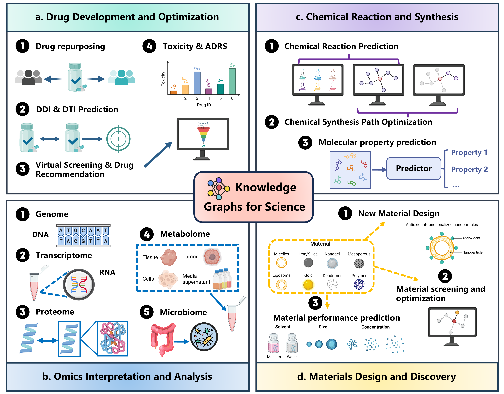

# Awesome-Scientific-Knowledge-Graphs

A comprehensive overview of Scientific Knowledge Graphs (SciKGs), organized in reference to our survey, covering construction methods, applications, integration with LLMs, and future challenges: ***Knowledge Graphs for AI-Driven Scientific Discovery: Construction, Applications, and Challenges***

> If you notice any mistakes or have suggestions, please feel free to contact us at: Zhihui.Zhu01@outlook.com

## 📑 Table of Contents

- [Awesome-Scientific-Knowledge-Graphs](#awesome-scientific-knowledge-graphs)
  - [📑 Table of Contents](#-table-of-contents)
  - [🧬 Research Scope Across Scientific Domains (To Top👆🏻)](#-research-scope-across-scientific-domains-to-top)
  - [🔗 Evolution of KGs and SciKG Applications (To Top👆🏻)](#-evolution-of-kgs-and-scikg-applications-to-top)
  - [🏗️ Construction and Maintenance of SciKGs (To Top👆🏻)](#️-construction-and-maintenance-of-scikgs-to-top)
  - [🤝 SciKG–LLM Integration for Scientific Discovery (To Top👆🏻)](#-scikgllm-integration-for-scientific-discovery-to-top)
  - [⚖️ Challenges and Opportunities in SciKGs (To Top👆🏻)](#️-challenges-and-opportunities-in-scikgs-to-top)
  - [Application of SciKGs](#application-of-scikgs)
    - [Drug Development and Optimization (To Top👆🏻)](#drug-development-and-optimization-to-top)
    - [Omics Interpretation and Analysis (To Top👆🏻)](#omics-interpretation-and-analysis-to-top)
    - [Chemical Reaction and Synthesis (To Top👆🏻)](#chemical-reaction-and-synthesis-to-top)
    - [Materials Design and Discovery (To Top👆🏻)](#materials-design-and-discovery-to-top)
  - [Summary of SciKG-LLM Integration (To Top👆🏻)](#summary-of-scikg-llm-integration-to-top)
  - [Databases for Constructing Scientific Knowledge Graph (To Top👆🏻)](#databases-for-constructing-scientific-knowledge-graph-to-top)
  - [Software Tools for Knowledge Graph (To Top👆🏻)](#software-tools-for-knowledge-graph-to-top)
  - [📅 Star History](#-star-history)

## 🧬 Research Scope Across Scientific Domains ([To Top👆🏻](#Awesome-Scientific-Knowledge-Graph))

An overview of the scope in this survey, covering four fundamental scientific tasks in biology, chemistry, and materials science: (a) drug development and optimization, (b) omics interpretation and analysis, (c) chemical reaction and synthesis, and (d) materials design and discovery.

## 🔗 Evolution of KGs and SciKG Applications ([To Top👆🏻](#Awesome-Scientific-Knowledge-Graph))

The co-evolution of knowledge graph technologies and their scientific practices. The technological evolution of KGs (top) has continually enabled new paradigms in SciKG applications (bottom). This progression has moved from static cataloguing and manual integration to machine learning-driven inference, culminating in the current era of bidirectional synergy between LLMs and KGs. This synergy, leveraging tools such as RAG and AI agents, transforms SciKGs from static repositories into dynamic engines for generative scientific discovery. Abbr., SQL: Structured Query Language; RDF: Resource Description Framework; OWL: Web Ontology Language; SPARQL: SPARQL Protocol and RDF Query Language; GNN: graph neural network; KGE: knowledge graph embedding; RAG: retrieval-augmented generation.

## 🏗️ Construction and Maintenance of SciKGs ([To Top👆🏻](#Awesome-Scientific-Knowledge-Graph))

Construction and maintenance of SciKGs. (a) The foundation of SciKG construction involves integrating diverse data sources, including structured databases, unstructured text, and multimodal data. (b) Two main approaches for extracting entities and relations from the acquired data are illustrated: rule/dictionary-based extraction, which relies on predefined lexicons and rules, and LLM-based extraction, involving fine-tuning on scientific datasets and prompt engineering. (c) Ontology alignment integrates diverse representations of the same entity (e.g., aspirin), followed by graph embedding into a continuous vector space. (d) Dynamic updating through incremental learning and LLM-driven error correction ensures SciKGs remain accurate and up to date. (e-h) Sub-figures illustrate representative examples of specialized knowledge graphs for drugs, omics, chemicals, and materials, respectively.

## 🤝 SciKG–LLM Integration for Scientific Discovery ([To Top👆🏻](#Awesome-Scientific-Knowledge-Graph))

Synergistic integration of SciKGs and LLMs for knowledge-driven scientific discovery. (a) SciKGs serve as the foundational knowledge infrastructure by ensuring factual grounding and verification, defining reasonable scientific boundaries, and enabling unified representation of heterogeneous data. (b) LLMs act as dynamic semantic engines through five core functions: semantic interface for knowledge access, analytical reasoner for inference, generative engine for hypothesis design, constructor for knowledge curation, and orchestrator for workflow automation. (c) The SciKG-LLM integration empowers four key scientific discovery tasks: multi-source data interpretation, complex system mechanism analysis, system performance optimization, and innovative solution design.

## ⚖️ Challenges and Opportunities in SciKGs ([To Top👆🏻](#Awesome-Scientific-Knowledge-Graph))

Challenges and Opportunities in SciKGs. This figure illustrates the major challenges (C1-C4) facing SciKGs, including data quality and completeness, interoperability and integration, dynamic and temporal knowledge, and trustworthy and explainable reasoning. Each challenge is paired with corresponding opportunities (O1-O4) for advancement, such as building standards and benchmarks, integrating multimodal foundation models, autonomous updating via agents, and developing community-driven platforms. The green sections depict workflows (W1-W4) that enable these opportunities, highlighting a path towards more auditable, unified, dynamic, and community-governed SciKGs.

## Application of SciKGs

### Drug Development and Optimization ([To Top👆🏻](#Awesome-Scientific-Knowledge-Graph))

| Year | Title                                                                                                                                     | KG Name                                                                    | KG Type             | Domain                                                                          | Construction Method | Venue                                                                  | Paper                                                                                                                                                                                                                                    | Code                                                                                                                                                                                                              |
| ---- | ----------------------------------------------------------------------------------------------------------------------------------------- | -------------------------------------------------------------------------- | ------------------- | ------------------------------------------------------------------------------- | ------------------- | ---------------------------------------------------------------------- | ---------------------------------------------------------------------------------------------------------------------------------------------------------------------------------------------------------------------------------------- | ----------------------------------------------------------------------------------------------------------------------------------------------------------------------------------------------------------------- |
| 2025 | TarIKGC: A Target Identification Tool Using Semantics-Enhanced Knowledge Graph Completion with Application to CDK2 Inhibitor Discovery    | biological activity KG                                                     | public KG           | DTI prediction                                                                  | Semi-automated      | Journal of Medicinal Chemistry                                         | [Link](https://pubs.acs.org/doi/10.1021/acs.jmedchem.4c02543)                                                                                                                                                                               | [Link](https://github.com/shenxj9/TarIKGC)                                                                                                    |
| 2025 | A comprehensive large-scale biomedical knowledge graph for AI-powered data-driven biomedical research                                     | iKraph                                                                     | Multi-source KG     | Drug repurposing and Hypothesis Generation                                      | Semi-automated      | Nature Machine Intelligence                                            | [Link](https://www.nature.com/articles/s42256-025-01014-w)                                                                                                                                                                                  | [Link](https://github.com/myinsilicom/iKraph)                                                                                              |
| 2025 | VITAGRAPH: Building a Knowledge Graph for Biologically Relevant Learning Tasks                                                            | VITAGRAPH                                                                  | public KG           | Drug repurposing                                                                | Semi-automated      | arXiv                                                                  | [Link](https://arxiv.org/pdf/2505.11185)                                                                                                                                                                                                    | [Link](https://github.com/gidecarlo/vitagraph)                                                                                            |
| 2024 | A Foundation Model for Clinician-Centered Drug Repurposing                                                                                | /                                                                          | public KG           | Drug repurposing                                                                | Semi-automated      | Nature Medicine                                                        | [Link](https://www.nature.com/articles/s41591-024-03233-x)                                                                                                                                                                                  | [Link](https://github.com/mims-harvard/TxGNN)                                                                                              |
| 2024 | Accurate and Interpretable Drug-Drug Interaction Prediction Enabled by Knowledge Subgraph Learning                                        | /                                                                          | public KG           | DDI prediction                                                                  | Automated           | Nature Communication Medicine                                          | [Link](https://www.nature.com/articles/s43856-024-00486-y)                                                                                                                                                                                  | [Link](https://github.com/LARS-research/KnowDDI)                                                                                        |
| 2024 | Knowledge Enhanced Representation Learning for Drug discovery                                                                             | MKG                                                                        | Multi-source KG     | DTI prediction and Virtual screening and drug discovery                         | Semi-automated      | AAAI                                                                   | [Link](https://ojs.aaai.org/index.php/AAAI/article/view/28924)                                                                                                                                                                              | [Link](https://github.com/IBM/otter-knowledge)                                                                                            |
| 2024 | An experimentally validated approach to automated biological evidence generation in drug discovery using knowledge graphs                 | Healx KG                                                                   | public KG           | Drug repurposing                                                                | Semi-automated      | Nature Communications                                                  | [Link](https://www.nature.com/articles/s41467-024-50024-6)                                                                                                                                                                                  | [Link](https://github.com/healx/automated-biological-evidence-generation-in-drug-discovery)  |
| 2024 | DDI-GPT: Explainable Prediction of Drug-Drug Interactions using Large Language Models enhanced with Knowledge Graphs                      | iBKH                                                                       | public KG           | DDI prediction                                                                  | Semi-automated      | bioRxiv                                                                | [Link](https://www.biorxiv.org/content/10.1101/2024.12.06.627266v1.full.pdf)                                                                                                                                                                | [Link](https://github.com/Mew233/ddigpt)                                                                                                        |
| 2024 | MKG-FENN: A Multimodal Knowledge Graph Fused End-to-End Neural Network for Accurate Drug–Drug Interaction Prediction                     | MKG                                                                        | Multi-source KG     | DDI prediction                                                                  | Automated           | AAAI                                                                   | [Link](https://ojs.aaai.org/index.php/AAAI/article/view/28887)                                                                                                                                                                              | [Link](https://github.com/wudi1989/MKG-FENN)                                                                                                |
| 2024 | TransFOL: A Logical Query Model for Complex Relational Reasoning in Drug-Drug Interaction                                                 | /                                                                          | public KG           | DDI prediction                                                                  | Semi-automated      | Journal of Biomedical and Health Informatics                           | [Link](https://ieeexplore.ieee.org/document/10530338/)                                                                                                                                                                                      | [Link](https://github.com/Cheng0829/TransFOL)                                                                                              |
| 2024 | KGRLFF: Detecting Drug-Drug Interactions Based on Knowledge Graph Representation Learning and Feature Fusion                              | /                                                                          | public KG           | DDI prediction                                                                  | Semi-automated      | TCBB                                                                   | [Link](https://ieeexplore.ieee.org/document/10613488/authors#authors)                                                                                                                                                                       | [Link](https://github.com/YStrong-zz/KGRLFF)                                                                                                |
| 2024 | An effective framework for predicting drug–drug interactions based on molecular substructures and knowledge graph neural network         | DKG (Drug knowledge graph)                                                 | public KG           | DDI prediction                                                                  | Semi-automated      | Computers in Biology and Medicine                                      | [Link](https://www.sciencedirect.com/science/article/pii/S0010482523013653)                                                                                                                                                                 | [Link](https://github.com/SchenLab/MSKG-DDI)                                                                                                |
| 2024 | Medical knowledge graph question answering for drug‐drug interaction prediction based on multi‐hop machine reading comprehension        | /                                                                          | public KG           | DDI prediction                                                                  | Automated           | CAAI Transactions on Intelligence Technology                           | [Link](https://ietresearch.onlinelibrary.wiley.com/doi/10.1049/cit2.12332)                                                                                                                                                                  |                                                                                                                                                                                                                   |
| 2024 | Integrated Knowledge Graph and Drug Molecular Graph Fusion via Adversarial Networks for Drug–Drug Interaction Prediction                 | DrugBank                                                                   | public KG           | DDI prediction                                                                  | Semi-automated      | JCIM                                                                   | [Link](https://pubs.acs.org/doi/10.1021/acs.jcim.4c01647)                                                                                                                                                                                   | [Link](https://github.com/Nokeli/KGDGANDDI)                                                                                                  |
| 2024 | KGE-UNIT: toward the unification of molecular interactions prediction based on knowledge graph and multi-task learning on drug discovery  | /                                                                          | Multi-source KG     | DDI prediction, DTI prediction and Hypothesis Generation                        | Automated           | Briefings in Bioinformatics                                            | [Link](https://academic.oup.com/bib/article/25/2/bbae043/7606633?login=false)                                                                                                                                                               | [Link](https://github.com/zcc1203/KGE-UNIT)                                                                                                  |
| 2023 | Biomedical Knowledge Graph Learning for Drug Repurposing by Extending Guilt-By Association to Multiple Layers                             | /                                                                          | public KG           | Drug repurposing                                                                | Semi-automated      | Nature Communications                                                  | [Link](https://www.nature.com/articles/s41467-023-39301-y)                                                                                                                                                                                  | [Link](https://github.com/eugenebang/DREAMwalk)                                                                                          |
| 2023 | Evolution-strengthened knowledge graph enables predicting the targetability and druggability of genes                                     | ESKG (Evolution-strengthened KG)                                           | public KG           | DTI prediction                                                                  | Semi-automated      | PNAS nexus                                                             | [Link](https://academic.oup.com/pnasnexus/article/2/5/pgad147/7143547?login=false)                                                                                                                                                          | [Link](https://github.com/Zhankun-Xiong/GraphEvo)                                                                                      |
| 2023 | Drugomics: Knowledge Graph & AI to Construct Physicians' Brain Digital Twin to Prevent Drug Side-Effects and Patient Harm                 | Drugomics KG                                                               | Multi-source KG     | Drug toxicity and adverse reactions                                             | Semi-automated      | Big Data Analytics                                                     | [Link](https://link.springer.com/chapter/10.1007/978-3-031-24094-2_10)                                                                                                                                                                      |                                                                                                                                                                                                                   |
| 2023 | Molecular-evaluated and explainable drug repurposing for COVID-19 using ensemble knowledge graph embedding                                | /                                                                          | Multi-source KG     | Drug repurposing                                                                | Semi-automated      | Scientific Reports                                                     | [Link](https://www.nature.com/articles/s41598-023-30095-z)                                                                                                                                                                                  | [Link](https://gitlab.inria.fr/capsid.public_codes/drug-repurposing-covid19)                                     |
| 2023 | Toxicology knowledge graph for structural birth defects                                                                                   | ReproTox-KG                                                                | Multi-source KG     | Drug toxicity and adverse reactions and Hypothesis Generation                   | Semi-automated      | Communications medicine                                                | [Link](https://www.nature.com/articles/s43856-023-00329-2)                                                                                                                                                                                  | [Link](https://github.com/nih-cfde/ReproToxTables)                                                                                    |
| 2023 | NAFLDkb: A Knowledge Base and Platform for Drug Development against Nonalcoholic Fatty Liver Disease                                      | NAFLDkb                                                                    | Multi-source KG     | Drug repurposing                                                                | Semi-automated      | JCIM                                                                   | [Link](https://pubs.acs.org/doi/10.1021/acs.jcim.3c00395)                                                                                                                                                                                   | [Link](https://github.com/tjcadd2020/NAFLDkb)                                                                                              |
| 2023 | Molecule generation toward target protein (SARS-CoV-2) using reinforcement learning-based graph neural network via knowledge graph        | /                                                                          | domain-specific KG  | Virtual screening and drug discovery, DTI prediction, and Hypothesis Generation | Semi-automated      | Network Modeling and Analysis in Health Informatics and Bioinformatics | [Link](https://link.springer.com/article/10.1007/s13721-023-00409-2)                                                                                                                                                                        |                                                                                                                                                                                                                   |
| 2022 | e-TSN: an Interactive Visual Exploration Platform for Target-Disease Knowledge Mappling from Literature                                   | e-TSN KG                                                                   | literature-based KG | DTI prediction                                                                  | Automated           | Briefings in Bioinformatics                                            | [Link](https://academic.oup.com/bib/article/23/6/bbac465/6809962?login=false)                                                                                                                                                               |                                                                                                                                                                                                                   |
| 2022 | Attention-based knowledge graph representation learning for predicting drug-drug interactions                                             | /                                                                          | public KG           | DDI prediction                                                                  | Semi-automated      | Briefings in Bioinformatics                                            | [Link](https://academic.oup.com/bib/article/23/3/bbac140/6572660?login=false)                                                                                                                                                               | [Link](https://github.com/Blair1213/DDKG)                                                                                                      |
| 2022 | Automating Predictive Toxicology Using ComptoxAI                                                                                          | ComptoxAI KG                                                               | public KG           | Drug toxicity and adverse reactions                                             | Semi-automated      | Chemical Research in Toxicology                                        | [Link](https://pubs.acs.org/doi/10.1021/acs.chemrestox.2c00074)                                                                                                                                                                             | [Link](https://github.com/JDRomano2/comptox_ai)                                                                                          |
| 2022 | KG-MTL: Knowledge Graph Enhanced Multi-Task Learning for Molecular Interaction                                                            | DRKG                                                                       | public KG           | DTI prediction                                                                  | Automated           | IEEE                                                                   | [Link](https://xuanlin1991.github.io/files/publications/KG-MTL_TKDE2022.pdf)                                                                                                                                                                | [Link](https://github.com/xzenglab/KG-MTL)                                                                                                    |
| 2021 | A Unified Drug-Target Interaction Prediction Framework Based on Knowledge Graph and Recommendation System                                 | /                                                                          | public KG           | DTI prediction                                                                  | Semi-automated      | Nature Communications                                                  | [Link](https://www.nature.com/articles/s41467-021-27137-3)                                                                                                                                                                                  | [Link](https://zenodo.org/record/5500305)                                                                                                                                                                            |
| 2021 | Biological Insights Knowledge Graph: an integrated knowledge graph to support drug development                                            | BIKG                                                                       | Multi-source KG     | DTI prediction and Drug repurposing                                             | Semi-automated      | bioRxiv                                                                | [Link](https://www.biorxiv.org/content/10.1101/2021.10.28.466262v1)                                                                                                                                                                         |                                                                                                                                                                                                                   |
| 2021 | SumGNN: multi-typed drug interaction prediction via efficient knowledge graph summarization                                               | /                                                                          | public KG           | DDI prediction                                                                  | Semi-automated      | Bioinformatics                                                         | [Link](https://academic.oup.com/bioinformatics/article/37/18/2988/6189090?login=false)                                                                                                                                                      | [Link](https://github.com/yueyu1030/SumGNN)                                                                                                  |
| 2021 | Predicting Potential Drug Targets Using Tensor Factorisation and Knowledge Graph Embeddings                                               | Hetionet                                                                   | public KG           | DTI prediction                                                                  | Semi-automated      | BIOKDD                                                                 | [Link](https://arxiv.org/pdf/2105.10578v2)                                                                                                                                                                                                  |                                                                                                                                                                                                                   |
| 2021 | Adverse Drug Reaction Discovery Using a Tumor-Biomarker Knowledge Graph                                                                   | TBKG (Tumor-biomarker KG)                                                  | literature-based KG | Drug toxicity and adverse reactions                                             | Semi-automated      | Frontiers in Genetics                                                  | [Link](https://www.frontiersin.org/journals/genetics/articles/10.3389/fgene.2020.625659/full)                                                                                                                                               |                                                                                                                                                                                                                   |
| 2021 | Investigating ADR mechanisms with Explainable AI: a feasibility study with knowledge graph mining                                         | PGxLOD                                                                     | Multi-source KG     | Drug toxicity and adverse reactions                                             | Semi-automated      | BMC Medical Informatics and Decision Making                            | [Link](https://bmcmedinformdecismak.biomedcentral.com/articles/10.1186/s12911-021-01518-6)                                                                                                                                                  |                                                                                                                                                                                                                   |
| 2020 | Discovering Protein Drug Targets Using Knowledge Graph Embeddings                                                                         | a knowledge graph of biological entities related to both drugs and targets | public KG           | DTI prediction                                                                  | Automated           | Bioinformatics                                                         | [Link](https://academic.oup.com/bioinformatics/article/36/2/603/5542390)                                                                                                                                                                    |                                                                                                                                                                                                                   |
| 2020 | KGNN: Knowledge Graph Neural Network for Drug-Drug Interaction Prediction                                                                 | /                                                                          | public KG           | DDI prediction                                                                  | Semi-automated      | IJCAI                                                                  | [Link](https://www.ijcai.org/proceedings/2020/0380.pdf)                                                                                                                                                                                     | [Link](https://github.com/xzenglab/KGNN)                                                                                                        |
| 2020 | Network-based prediction of drug–target interactions using an arbitrary-order proximity embedded deep forest                             | /                                                                          | public KG           | DTI prediction                                                                  | Semi-automated      | Bioinformatics                                                         | [Link](https://academic.oup.com/bioinformatics/article/36/9/2805/5714734?login=false)                                                                                                                                                       | [Link](https://github.com/ChengF-Lab/AOPEDF)                                                                                                |
| 2019 | Evaluation of knowledge graph embedding approaches for drug-drug interaction prediction in realistic settings                             | /                                                                          | public KG           | DDI prediction                                                                  | Semi-automated      | BMC Bioinformatics                                                     | [Link](https://bmcbioinformatics.biomedcentral.com/articles/10.1186/s12859-019-3284-5)                                                                                                                                                      | [Link](https://github.com/rcelebi/GraphEmbedding4DDI/)                                                                             |
| 2019 | Drug-Drug Interaction Prediction Based on Knowledge Graph Embeddings and Convolutional-LSTM Network                                       | /                                                                          | public KG           | DDI prediction                                                                  | Semi-automated      | arXiv                                                                  | [Link](https://www.researchgate.net/publication/334987060_Drug-Drug_Interaction_Prediction_Based_on_Knowledge_Graph_Embeddings_and_Convolutional-LSTM_Network)                                                                              | [Link](https://github.com/YifanDengWHU/Drug-drug-interaction-prediction)                                        |
| 2019 | GAMENet: Graph Augmented MEmory Networks for Recommending Medication Combination                                                          | EHR&DDI Graph                                                              | domain-specific KG  | Virtual screening and drug discovery                                            | Automated           | AAAI                                                                   | [Link](https://ojs.aaai.org/index.php/AAAI/article/view/3905)                                                                                                                                                                               | [Link](https://github.com/sjy1203/GAMENet)                                                                                                    |
| 2019 | Facilitating prediction of adverse drug reactions by using knowledge graphs and multi‐label learning models                              | Bio2RDF KG                                                                 | public KG           | Drug toxicity and adverse reactions                                             | Automated           | Briefings in Bioinformatics                                            | [Link](https://academic.oup.com/bib/article/20/1/190/4085292?login=false)                                                                                                                                                                   |                                                                                                                                                                                                                   |
| 2018 | Modeling polypharmacy side effects with graph convolutional networks                                                                      | /                                                                          | public KG           | Drug toxicity and adverse reactions                                             | Semi-automated      | Bioinformatics                                                         | [Link](https://academic.oup.com/bioinformatics/article/34/13/i457/5045770?login=false)                                                                                                                                                      |                                                                                                                                                                                                                   |
| 2018 | Neural networks for link prediction in realistic biomedical graphs: a multi-dimensional evaluation of graph embedding-based approaches    | /                                                                          | public KG           | DTI prediction                                                                  | Semi-automated      | BMC Bioinformatics                                                     | [Link](https://bmcbioinformatics.biomedcentral.com/articles/10.1186/s12859-018-2163-9#:~:text=We%20investigated%20how%20inputs%20from%20four%20node%20representation,graphs%20of%20real-world%20sizes%20%28%E2%88%BC%206%20million%20edges) |                                                                                                                                                                                                                   |
| 2017 | A Network Integration Approach for Drug-Target Interaction Prediction and Computational Drug Repositioning from Heterogeneous Information | /                                                                          | public KG           | DTI prediction and Drug repurposing                                             | Semi-automated      | Nature Communications                                                  | [Link](https://www.nature.com/articles/s41467-017-00680-8)                                                                                                                                                                                  | [Link](https://github.com/luoyunan/DTINet)                                                                                                    |
| 2017 | Knowledge graph prediction of unknown adverse drug reactions and validation in electronic health records                                  | /                                                                          | public KG           | Drug toxicity and adverse reactions                                             | Semi-automated      | Scientific Reports                                                     | [Link](https://www.nature.com/articles/s41598-017-16674-x)                                                                                                                                                                                  | [Link](https://github.com/KHP-Informatics/ADR-graph)                                                                                |
| 2017 | Large-scale structural and textual similarity-based mining of knowledge graph to predict drug–drug interactions                          | /                                                                          | public KG           | DDI prediction                                                                  | Semi-automated      | Journal of Web Semantics                                               | [Link](https://www.sciencedirect.com/science/article/pii/S157082681730029X)                                                                                                                                                                 |                                                                                                                                                                                                                   |
| 2017 | Deep mining heterogeneous networks of biomedical linked data to predict novel drug–target associations                                   | LTN (Linked Tripartite Network)                                            | public KG           | DTI prediction                                                                  | Semi-automated      | Bioinformatics                                                         | [Link](https://academic.oup.com/bioinformatics/article/33/15/2337/3738543?login=false)                                                                                                                                                      | [Link](https://github.com/zongnansu1982/drug-target-prediction)                                                          |

### Omics Interpretation and Analysis ([To Top👆🏻](#Awesome-Scientific-Knowledge-Graph))

| Year | Title                                                                                                                                                                             | KG Name                                                                      | KG Type             | Domain                   | Construction Method | Venue                                                   | Paper                                                                                                                                                                                 | Code                                                                                                                                                                      |
| ---- | --------------------------------------------------------------------------------------------------------------------------------------------------------------------------------- | ---------------------------------------------------------------------------- | ------------------- | ------------------------ | ------------------- | ------------------------------------------------------- | ------------------------------------------------------------------------------------------------------------------------------------------------------------------------------------- | ------------------------------------------------------------------------------------------------------------------------------------------------------------------------- |
| 2025 | A novel approach for target deconvolution from phenotype-based screening using knowledge graph                                                                                    | P53_HUMAN PPIKG                                                              | public KG           | Proteomics research      | Semi-automated      | Scientific Reports                                      | [Link](https://www.nature.com/articles/s41598-025-86166-w)                                                                                                                               | [Link](https://github.com/Xiong-Jing/PPIKG)                                                          |
| 2025 | Unified Knowledge-Guided Molecular Graph Encoder with multimodal fusion and multi-task learning                                                                                   | Elemental KG and Biological KG                                               | Multi-source KG     | Proteomics research      | Semi-automated      | Neural Networks                                         | [Link](https://www.sciencedirect.com/science/article/pii/S0893608024009973?via%3Dihub)                                                                                                   |                                                                                                                                                                           |
| 2025 | PhenoKG: Knowledge Graph-Driven Gene Discovery and Patient Insights from Phenotypes Alone                                                                                         | PhenoKG                                                                      | public KG           | Genomics research        | Semi-automated      | arXiv                                                   | [Link](https://papers.cool/arxiv/2506.13119)                                                                                                                                             |                                                                                                                                                                           |
| 2024 | Petagraph: A large-scale unifying knowledge graph framework for integrating biomolecular and biomedical data                                                                      | Petagraph                                                                    | Multi-source KG     | Genomics research        | Semi-automated      | Scientific Data                                         | [Link](https://www.nature.com/articles/s41597-024-04070-w)                                                                                                                               | [Link](https://github.com/TaylorResearchLab/Petagraph/blob/main/petagraph/user_guide.md)  |
| 2024 | An ontology-based knowledge graph for representing interactions involving RNA molecules                                                                                           | RNA-KG                                                                       | Multi-source KG     | Transcriptomics research | Semi-automated      | Scientific Data                                         | [Link](https://www.nature.com/articles/s41597-024-03673-7)                                                                                                                               | [Link](https://github.com/AnacletoLAB/RNA-KG)                                                      |
| 2024 | Knowledge graph construction based on granulosa cells transcriptome from polycystic ovary syndrome with normoandrogen and hyperandrogen                                           | causal KG                                                                    | Multi-source KG     | Transcriptomics research | Semi-automated      | Journal of Ovarian Research                             | [Link](https://ovarianresearch.biomedcentral.com/articles/10.1186/s13048-024-01361-z)                                                                                                    |                                                                                                                                                                           |
| 2024 | Multi-Modal Protein Knowledge Graph Construction and Applications (Student Abstract)                                                                                              | ProteinKG65                                                                  | Multi-source KG     | Proteomics research      | Semi-automated      | AAAI                                                    | [Link](https://ojs.aaai.org/index.php/AAAI/article/view/26955)                                                                                                                           | [Link](https://github.com/zjunlp/OntoProtein)                                                      |
| 2024 | Bridging chemical structure and conceptual knowledge enables accurate prediction of compound-protein interaction                                                                  | DRKG                                                                         | public KG           | Proteomics research      | Manual              | BMC Biology                                             | [Link](https://bmcbiol.biomedcentral.com/articles/10.1186/s12915-024-02049-y)                                                                                                            | [Link](https://github.com/wentao228/BEACON)                                                          |
| 2024 | Integration of chromosome locations and functional aspects of enhancers and topologically associating domains in knowledge graphs enables versatile queries about gene regulation | crm, crm2gene, crm2tfac, crm2phen, tad, human genes (after ampliation) graph | public KG           | Genomics research        | Semi-automated      | Nucleic Acids Research                                  | [Link](https://academic.oup.com/nar/article/52/15/e69/7706482?login=false)                                                                                                               | [Link](https://github.com/juan-mulero/cisreg)                                                      |
| 2024 | Identifying compound-protein interactions with knowledge graph embedding of perturbation transcriptomics                                                                          | /                                                                            | public KG           | Proteomics research      | Semi-automated      | Cell Genomics                                           | [Link](https://www.cell.com/cell-genomics/fulltext/S2666-979X(24)00266-0?_returnURL=https%3A%2F%2Flinkinghub.elsevier.com%2Fretrieve%2Fpii%2FS2666979X24002660%3Fshowall%3Dtrue#sec-8-1) | [Link](https://github.com/myzhengSIMM/PertKGE)                                                    |
| 2023 | MMiKG: a knowledge graph-based platform for path mining of microbiota–mental diseases interactions                                                                               | MMiKG                                                                        | literature-based KG | Microbiome research      | Manual              | Briefings in Bioinformatics                             | [Link](https://academic.oup.com/bib/article/24/6/bbad340/7287430?login=false)                                                                                                            |                                                                                                                                                                           |
| 2023 | Transporter proteins knowledge graph construction and its application in drug development                                                                                         | Transporter Proteins Knowledge Graph                                         | public KG           | Proteomics research      | Semi-automated      | Computational and Structural Biotechnology Journal      | [Link](https://www.csbj.org/article/S2001-0370(23)00183-6/fulltext)                                                                                                                      |                                                                                                                                                                           |
| 2023 | A Knowledge Graph Approach to Elucidate the Role of Organellar Pathways in Disease via Biomedical Reports                                                                         | /                                                                            | Multi-source KG     | Proteomics research      | Semi-automated      | JoVE Journal of Biochemistry                            | [Link](https://app.jove.com/t/65084/a-knowledge-graph-approach-to-elucidate-role-organellar-pathways)                                                                                    |                                                                                                                                                                           |
| 2022 | Knowledge-graph-based cell-cell communication inference for spatially resolved transcriptomic data with SpaTalk                                                                   | LRT-KG                                                                       | public KG           | Transcriptomics research | Semi-automated      | Nature Communications                                   | [Link](https://www.nature.com/articles/s41467-022-32111-8)                                                                                                                               | [Link](https://github.com/ZJUFanLab/SpaTalk)                                                        |
| 2022 | A knowledge graph to interpret clinical proteomics data                                                                                                                           | CKG (Clinical Knowledge graph)                                               | Multi-source KG     | Proteomics research      | Semi-automated      | Nature Biotechnology                                    | [Link](https://www.nature.com/articles/s41587-021-01145-6)                                                                                                                               | [Link](https://github.com/MannLabs/CKG)                                                                  |
| 2022 | Knowledge integration and decision support for accelerated discovery of antibiotic resistance genes                                                                               | E. coli knowledge graph                                                      | public KG           | Genomics research        | Semi-automated      | Nature Communications                                   | [Link](https://www.nature.com/articles/s41467-022-29993-z)                                                                                                                               | [Link](https://github.com/IBPA/KIDS)                                                                        |
| 2022 | Machine learning prediction and tau-based screening identifies potential Alzheimer's disease genes relevant to immunity                                                           | PKG (protein knowledge graph)                                                | public KG           | Proteomics research      | Semi-automated      | Communications Biology                                  | [Link](https://www.nature.com/articles/s42003-022-03068-7)                                                                                                                               | [Link](https://github.com/unmtransinfo/ProteinGraphML)                                    |
| 2022 | OntoProtein: Protein Pretraining With Gene Ontology Embedding                                                                                                                     | ProteinKG25                                                                  | public KG           | Proteomics research      | Automated           | ICLR                                                    | [Link](https://ar5iv.labs.arxiv.org/html/2201.11147)                                                                                                                                     | [Link](https://github.com/zjunlp/OntoProtein)                                                      |
| 2022 | GenomicKB: a knowledge graph for the human genome                                                                                                                                 | GenomicKB (Genomic Knowledgebase)                                            | Multi-source KG     | Genomics research        | Semi-automated      | Nucleic Acids Research                                  | [Link](https://academic.oup.com/nar/article/51/D1/D950/6786196?login=false)                                                                                                              |                                                                                                                                                                           |
| 2022 | Creating and Exploiting the Intrinsically Disordered Protein Knowledge Graph (IDP-KG)                                                                                             | IDP-KG                                                                       | public KG           | Proteomics research      | Automated           | CEUR Workshop Proceedings                               | [Link](https://ceur-ws.org/Vol-3127/paper-1.pdf)                                                                                                                                         | [Link](https://github.com/BioComputingUP/IDP-KG)                                                |
| 2022 | BioTAGME: A Comprehensive Platform for Biological Knowledge Network Analysis                                                                                                      | BioTAGME KG                                                                  | Multi-source KG     | Multi-Omics research     | Semi-automated      | Frontiers in Genetics                                   | [Link](https://www.frontiersin.org/journals/genetics/articles/10.3389/fgene.2022.855739/full)                                                                                            |                                                                                                                                                                           |
| 2022 | Biomedical knowledge graph embeddings for personalized medicine: Predicting disease-gene associations                                                                             | a biomedical KG for predicting disease-gene association                      | public KG           | Genomics research        | Semi-automated      | Expert Systems                                          | [Link](https://onlinelibrary.wiley.com/doi/10.1111/exsy.13181)                                                                                                                           | [Link](https://github.com/jrderuiter/pybiomart)                                                  |
| 2022 | Identifying genes targeted by disease-associated non-coding SNPs with a protein knowledge graph                                                                                   | Protein KG                                                                   | literature-based KG | Genomics research        | Semi-automated      | PLOS ONE                                                | [Link](https://journals.plos.org/plosone/article?id=10.1371/journal.pone.0271395#sec022)                                                                                                 | [Link](https://github.com/wjvlietstra-els/Post-GWAS)                                        |
| 2022 | KG-MTL: Knowledge Graph Enhanced Multi-Task Learning for Molecular Interaction                                                                                                    | DRKG                                                                         | public KG           | Proteomics research      | Automated           | IEEE                                                    | [Link](https://xuanlin1991.github.io/files/publications/KG-MTL_TKDE2022.pdf)                                                                                                             | [Link](https://github.com/xzenglab/KG-MTL)                                                            |
| 2021 | FORUM: building a Knowledge Graph from public databases and scientific literature to extract associations between chemicals and diseases                                          | FORUM                                                                        | Multi-source KG     | Metabolomics research    | Semi-automated      | Bioinformatics                                          | [Link](https://academic.oup.com/bioinformatics/article/37/21/3896/6363786?login=false)                                                                                                   | [Link](https://github.com/eMetaboHUB/Forum-DiseasesChem)                                |
| 2020 | Exploring the Microbiota-Gut-Brain Axis for Mental Disorders with Knowledge Graphs                                                                                                | MiKG (Microbiota knowledge graph)                                            | Multi-source KG     | Microbiome research      | Semi-automated      | Journal of Artificial Intelligence for Medical Sciences | [Link](https://www.researchgate.net/publication/347881678_Exploring_the_Microbiota-Gut-Brain_Axis_for_Mental_Disorders_with_Knowledge_Graphs)                                            | [Link](https://github.com/tingcosmos/MiKG-JAIMS.git)                                            |
| 2020 | Metastatic Site Prediction in Breast Cancer using Omics Knowledge Graph and Pattern Mining with Kirchhoff's Law Traversal                                                         | Kirchhoff's KG                                                               | public KG           | Multi-Omics research     | Semi-automated      | bioRxiv                                                 | [Link](https://www.biorxiv.org/content/10.1101/2020.07.14.203208v2.full.pdf)                                                                                                             |                                                                                                                                                                           |
| 2020 | Accurate prediction of kinase-substrate networks using knowledge graphs                                                                                                           | a phosphorylation knowledge graph                                            | public KG           | Proteomics research      | Automated           | PLoS Computational Biology                              | [Link](https://journals.plos.org/ploscompbiol/article?id=10.1371/journal.pcbi.1007578)                                                                                                   |                                                                                                                                                                           |
| 2020 | An integrative knowledge graph for rare diseases, derived from the Genetic and Rare Diseases Information Center (GARD)                                                            | an integrative KG for rare diseases                                          | Multi-source KG     | Genomics research        | Semi-automated      | Journal of Biomedical Semantics                         | [Link](https://jbiomedsem.biomedcentral.com/articles/10.1186/s13326-020-00232-y)                                                                                                         |                                                                                                                                                                           |
| 2019 | Predicting gene-disease associations from the heterogeneous network using graph embedding                                                                                         | /                                                                            | public KG           | Genomics research        | Semi-automated      | IEEE                                                    | [Link](https://ieeexplore.ieee.org/document/8983134/authors)                                                                                                                             |                                                                                                                                                                           |
| 2019 | GenomicsKG: A Knowledge Graph to Visualize Poly-Omics Data                                                                                                                        | GenomicsKG                                                                   | public KG           | Genomics research        | Semi-automated      | Journal of Advances in Health                           | [Link](https://www.sciengine.com/JAH/doi/10.3724/SP.J.2640-8686.2019.0063)                                                                                                               |                                                                                                                                                                           |
| 2018 | Semantic Disease Gene Embeddings (SmuDGE): phenotype-based disease gene prioritization without phenotypes                                                                         | /                                                                            | public KG           | Genomics research        | Semi-automated      | Bioinformatics                                          | [Link](https://academic.oup.com/bioinformatics/article/34/17/i901/5093225?login=false)                                                                                                   | [Link](https://github.com/bio-ontology-research-group/SmuDGE)                      |
| 2018 | Heterogeneous network embedding for identifying symptom candidate genes                                                                                                           | SDGNet&SDGPNet (two heterogeneous symptom-related networks)                  | public KG           | Genomics research        | Semi-automated      | JAMIA                                                   | [Link](https://academic.oup.com/jamia/article/25/11/1452/5142853?login=true)                                                                                                             |                                                                                                                                                                           |
| 2018 | Network-based integration of multi-omics data for prioritizing cancer genes                                                                                                       | /                                                                            | public KG           | Genomics research        | Semi-automated      | Bioinformatics                                          | [Link](https://academic.oup.com/bioinformatics/article/34/14/2441/4934938?login=false)                                                                                                   | [Link](https://github.com/cbg-ethz/netics)                                                            |
| 2016 | A knowledge-based approach for predicting gene–disease associations                                                                                                              | /                                                                            | public KG           | Genomics research        | Semi-automated      | Bioinformatics                                          | [Link](https://academic.oup.com/bioinformatics/article/32/18/2831/1744378?login=false)                                                                                                   |                                                                                                                                                                           |

### Chemical Reaction and Synthesis ([To Top👆🏻](#Awesome-Scientific-Knowledge-Graph))

| Year | Title                                                                                                                                          | KG Name                                                | KG Type             | Domain                                                                                                   | Construction Method | Venue                                                 | Paper                                                                               | Code                                                                                                                                          |
| ---- | ---------------------------------------------------------------------------------------------------------------------------------------------- | ------------------------------------------------------ | ------------------- | -------------------------------------------------------------------------------------------------------- | ------------------- | ----------------------------------------------------- | ----------------------------------------------------------------------------------- | --------------------------------------------------------------------------------------------------------------------------------------------- |
| 2025 | Bi-level Contrastive Learning for Knowledge-Enhanced Molecule Representations                                                                  | MolKG                                                  | public KG           | Molecular property prediction                                                                            | Semi-automated      | AAAI                                                  | [Link](https://arxiv.org/html/2306.01631v6)                                            | [Link](https://github.com/pat-jj/Gode)                                        |
| 2025 | Automated Retrosynthesis Planning of Macromolecules Using Large Language Models and Knowledge Graphs                                           | /                                                      | literature-based KG | Chemical synthesis pathway optimization                                                                  | Automated           | Macromolecular Rapid Communications                   | [Link](https://onlinelibrary.wiley.com/doi/full/10.1002/marc.202500065?saml_referrer)  | [Link](https://github.com/QinyuMa316/RetroSynthesisAgent)  |
| 2025 | An Automated Approach for Domain-Specific Knowledge Graph Generation─Graph Measures and Characterization                                      | /                                                      | literature-based KG | Chemical reaction prediction and Chemical Synthesis Pathway Optimization                                 | Automated           | JCIM                                                  | [Link](https://pubs.acs.org/doi/10.1021/acs.jcim.4c01904)                              |                                                                                                                                               |
| 2024 | Large-Scale Knowledge Integration for Enhanced Molecular Property Prediction                                                                   | ElementKG-CHEBI                                        | Multi-source KG     | Molecular property prediction                                                                            | Semi-automated      | Nesy                                                  | [Link](https://arxiv.org/pdf/2410.11914)                                               | [Link](https://github.com/Yasir-Ghunaim/KANO-ChEBI)              |
| 2024 | Self-Supervised Contrastive Molecular Representation Learning with a Chemical Synthesis Knowledge Graph                                        | Chemical synthesis KG                                  | public KG           | Chemical reaction prediction                                                                             | Semi-automated      | JCIM                                                  | [Link](https://pubs.acs.org/doi/10.1021/acs.jcim.4c00157)                              | [Link](https://github.com/biomed-AI/ReaKE)                                |
| 2023 | Knowledge graph-enhanced molecular contrastive learning with functional prompt                                                                 | ElementKG                                              | domain-specific KG  | Molecular property prediction                                                                            | Semi-automated      | Nature Machine Intelligence                           | [Link](https://www.nature.com/articles/s42256-023-00654-0)                             | [Link](https://github.com/HICAI-ZJU/KANO/)                                 |
| 2023 | Marie and BERT─A Knowledge Graph Embedding Based Question Answering System for Chemistry                                                      | TWA KG (the World Avatar KG) and Wikidata chemistry KG | Dynamic KG          | Chemical reaction prediction and Molecular property prediction                                           | Semi-automated      | ACS Omega                                             | [Link](https://pubs.acs.org/doi/10.1021/acsomega.3c05114)                              | [Link](https://github.com/cambridge-cares/TheWorldAvatar)  |
| 2022 | MKGE: Knowledge graph embedding with molecular structure information                                                                           | KCCR and DeepDDI                                       | public KG           | Molecular property prediction                                                                            | Semi-automated      | Computational Biology and Chemistry                   | [Link](https://www.sciencedirect.com/science/article/pii/S1476927122001104?via%3Dihub) |                                                                                                                                               |
| 2022 | Prediction of Compound Synthesis Accessibility Based on Reaction Knowledge Graph                                                               | Reaction knowledge graph                               | public KG           | Chemical reaction prediction, Molecular property prediction, and Chemical synthesis pathway optimization | Semi-automated      | Molecules                                             | [Link](https://www.mdpi.com/1420-3049/27/3/1039)                                       | [Link](https://github.com/jidushanbojue/YaSAScore)                |
| 2022 | Molecular Contrastive Learning with Chemical Element Knowledge Graph                                                                           | Chemical element KG                                    | domain-specific KG  | Molecular property prediction                                                                            | Semi-automated      | AAAI                                                  | [Link](https://arxiv.org/abs/2112.00544)                                               | [Link](https://github.com/ZJU-Fangyin/KCL)                                |
| 2022 | FAIR and Interactive Data Graphics from a Scientific Knowledge Graph                                                                           | /                                                      | literature-based KG | Chemical synthesis pathway optimization, Chemical reaction prediction, and Molecular property prediction | Semi-automated      | Scientific Data                                       | [Link](https://www.nature.com/articles/s41597-022-01352-z)                             |                                                                                                                                               |
| 2022 | From Platform to Knowledge Graph: Evolution of Laboratory Automation                                                                           | The World Avatar KG                                    | Dynamic KG          | Chemical Synthesis Pathway Optimization                                                                  | Semi-automated      | JACS Au                                               | [Link](https://pubs.acs.org/doi/10.1021/jacsau.1c00438)                                |                                                                                                                                               |
| 2021 | Intelligent generation of optimal synthetic pathways based on knowledge graph inference and retrosynthetic predictions using reaction big data | Reaction knowledge graph                               | public KG           | Chemical synthesis pathway optimization                                                                  | Semi-automated      | Journal of the Taiwan Institute of Chemical Engineers | [Link](https://www.sciencedirect.com/science/article/pii/S187610702100420X)            |                                                                                                                                               |
| 2021 | Automated Calibration of a Poly(oxymethylene) Dimethyl Ether Oxidation Mechanism Using the Knowledge Graph Technology                          | JPS KG                                                 | Dynamic KG          | Chemical reaction prediction and Chemical Synthesis Pathway Optimization                                 | Semi-automated      | JCIM                                                  | [Link](https://pubs.acs.org/doi/10.1021/acs.jcim.0c01322)                              |                                                                                                                                               |
| 2021 | A graph-based network for predicting chemical reaction pathways in solid-state materials synthesis                                             | /                                                      | domain-specific KG  | Chemical reaction prediction                                                                             | Automated           | Nature Communications                                 | [Link](https://www.nature.com/articles/s41467-021-23339-x)                             | [Link](https://github.com/GENESIS-EFRC/reaction-network)    |
| 2020 | Knowledge Graph Approach to Combustion Chemistry and Interoperability                                                                          | JPS KG                                                 | literature-based KG | Chemical reaction prediction                                                                             | Automated           | ACS Omega                                             | [Link](https://pubs.acs.org/doi/10.1021/acsomega.0c02055)                              |                                                                                                                                               |
| 2020 | Multiscale Cross-Domain Thermochemical Knowledge-Graph                                                                                         | JPS KG                                                 | Dynamic KG          | Chemical reaction prediction and Molecular property prediction                                           | Automated           | JCIM                                                  | [Link](https://pubs.acs.org/doi/10.1021/acs.jcim.0c01145)                              |                                                                                                                                               |
| 2016 | Modelling Chemical Reasoning to Predict and Invent Reactions                                                                                   | /                                                      | public KG           | Chemical reaction prediction                                                                             | Semi-automated      | Chemistry Europe                                      | [Link](https://arxiv.org/pdf/1608.07117)                                               |                                                                                                                                               |

### Materials Design and Discovery ([To Top👆🏻](#Awesome-Scientific-Knowledge-Graph))

| Year | Title                                                                                                                                                       | KG Name                                                            | KG Type                            | Domain                                                                  | Construction Method | Venue                                              | Paper                                                                          | Code                                                                                                                                                        |
| ---- | ----------------------------------------------------------------------------------------------------------------------------------------------------------- | ------------------------------------------------------------------ | ---------------------------------- | ----------------------------------------------------------------------- | ------------------- | -------------------------------------------------- | ------------------------------------------------------------------------------ | ----------------------------------------------------------------------------------------------------------------------------------------------------------- |
| 2025 | Construction of a knowledge graph for framework material enabled by large language models and its application                                               | KG-FM                                                              | literature-based KG                | Material screening and optimization                                     | Semi-automated      | npj Computational Materials                        | [Link](https://www.nature.com/articles/s41524-025-01540-6)                        | [Link](https://github.com/MontageBai/KGFM)                                              |
| 2025 | High throughput screening of new piezoelectric materials using graph machine learning and knowledge graph approach                                          | a simple KG encoding structural similarity between materials       | public KG                          | Material screening and optimization                                     | Semi-automated      | Computational Materials Science                    | [Link](https://www.sciencedirect.com/science/article/pii/S0927025624006669)       | [Link](https://github.com/archit342000/MatPiezo)                                  |
| 2024 | MatKG: An autonomously generated knowledge graph in Material Science                                                                                        | MatKG                                                              | literature-based KG                | New material design                                                     | Semi-automated      | Scientific Data                                    | [Link](https://www.nature.com/articles/s41597-024-03039-z)                        | [Link](https://github.com/olivettigroup/MatKG)                                      |
| 2024 | A materials terminology knowledge graph automatically constructed from text corpus                                                                          | MGED-KG                                                            | literature-based KG                | Material screening and optimization                                     | Semi-automated      | Scientific Data                                    | [Link](https://www.nature.com/articles/s41597-024-03448-0)                        | [Link](https://zenodo.org/records/11315713)                                                                                                                    |
| 2024 | Construction and Application of Materials Knowledge Graph in Multidisciplinary Materials Science via Large Language Model                                   | MKG                                                                | literature-based KG and dynamic KG | New material design                                                     | Semi-automated      | NeurIPS                                            | [Link](https://arxiv.org/pdf/2404.03080)                                          | [Link](https://github.com/MasterAI-EAM/Material-Knowledge-Graph)  |
| 2024 | Generative Retrieval-Augmented Ontologic Graph and Multiagent Strategies for Interpretive Large Language Model-Based Materials Design                       | Ontological KG                                                     | literature-based KG                | New material design and Material performance prediction                 | Semi-automated      | ACS Engineering Au                                 | [Link](https://pubs.acs.org/doi/10.1021/acsengineeringau.3c00058#_i27)            | [Link](https://github.com/lamm-mit/MeLM)                                                  |
| 2024 | SciAgents: Automating Scientific Discovery Through Bioinspired Multi-Agent Intelligent Graph Reasoning                                                      | an ontological knowledge graph for biologically inspired materials | literature-based KG                | New material design and Material performance prediction                 | Semi-automated      | Advanced Materials                                 | [Link](https://advanced.onlinelibrary.wiley.com/doi/10.1002/adma.202413523)       |                                                                                                                                                             |
| 2024 | An ontology-based text mining dataset for extraction of process-structure-property entities                                                                 | Materials mechanics ontology                                       | literature-based KG                | Material performance prediction                                         | Semi-automated      | Scientific Data                                    | [Link](https://www.nature.com/articles/s41597-024-03926-5)                        | [Link](https://gitlab.cc-asp.fraunhofer.de/iwm-micro-mechanics-public/datasets/materio-miner)                                                                  |
| 2024 | Material Property Prediction with Element Attribute Knowledge Graphs and Multimodal Representation Learning                                                 | Element KG                                                         | domain-specific KG                 | Material performance prediction                                         | Semi-automated      | arXiv                                              | [Link](https://arxiv.org/pdf/2411.08414)                                          |                                                                                                                                                             |
| 2024 | Knowledge graph-guided data-driven design of ultra-high-performance concrete (UHPC) with interpretability and physicochemical reaction discovery capability | UHPC KG                                                            | literature-based KG                | Material screening and optimization                                     | Manual              | Construction and Building Materials                | [Link](https://www.sciencedirect.com/science/article/pii/S095006182401643X)       |                                                                                                                                                             |
| 2023 | The materials experiment knowledge graph                                                                                                                    | MekG                                                               | domain-specific KG                 | Material performance prediction                                         | Semi-automated      | Digital Discovery                                  | [Link](https://pubs.rsc.org/en/content/articlelanding/2023/dd/d3dd00067b)         | [Link](https://github.com/modelyst/MekG-migrations)                            |
| 2023 | Revisiting Electrocatalyst Design by a Knowledge Graph of Cu-Based Catalysts for CO2 Reduction                                                              | Cu-Based Catalysts Knowledge Graph for CO2 Reduction               | literature-based KG                | New material design and Material performance prediction                 | Semi-automated      | ACS Catalysis                                      | [Link](https://pubs.acs.org/doi/10.1021/acscatal.3c00759)                         | [Link](https://github.com/cxqwindy/AI-CO2_reduction)                          |
| 2023 | Reinforcement learning-based knowledge graph reasoning for aluminum alloy applications                                                                      | Aluminum alloy domain KG                                           | public KG                          | Material performance prediction                                         | Semi-automated      | Computational Materials Science                    | [Link](https://www.sciencedirect.com/science/article/pii/S0927025623000691)       |                                                                                                                                                             |
| 2023 | Bridging the Semantic-Numerical Gap: A Numerical Reasoning Method of Cross-modal Knowledge Graph for Material Property Prediction                           | Cross-modal KG                                                     | Multi-source KG                    | Material performance prediction                                         | Semi-automated      | arXiv                                              | [Link](https://arxiv.org/pdf/2312.09744)                                          | [Link](https://github.com/MatrixBrain/NR-KG)                                          |
| 2023 | Digital Twin-Based Fault Diagnosis Platform for Final Rolling Temperature in Hot Strip Production                                                           | /                                                                  | domain-specific KG                 | Material screening and optimization                                     | Semi-automated      | Materials                                          | [Link](https://www.mdpi.com/1996-1944/16/21/7021)                                 |                                                                                                                                                             |
| 2022 | Grain Knowledge Graph Representation Learning: A New Paradigm for Microstructure-Property Prediction                                                        | Grain KG                                                           | domain-specific KG                 | Material performance prediction                                         | Semi-automated      | Crystals                                           | [Link](https://www.mdpi.com/2073-4352/12/2/280)                                   | [Link](https://github.com/shanty1/grainKG)                                              |
| 2022 | Automating Materials Exploration with a Semantic Knowledge Graph for Li-Ion Battery Cathodes                                                                | a semantic knowledge graph dedicated to LIB cathodes               | literature-based KG                | New material design                                                     | Semi-automated      | AFM                                                | [Link](https://advanced.onlinelibrary.wiley.com/doi/full/10.1002/adfm.202201437)  | [Link](https://github.com/AI-for-Materials/DATWEM)                              |
| 2022 | High-Throughput Computing Assisted by Knowledge Graph to Study the Correlation between Microstructure and Mechanical Properties of 6XXX Aluminum Alloy      | 6XXX Aluminum Alloy KG                                             | domain-specific KG                 | Material screening and optimization and Material performance prediction | Semi-automated      | Materials                                          | [Link](https://www.mdpi.com/1996-1944/15/15/5296)                                 |                                                                                                                                                             |
| 2022 | FAIR and Interactive Data Graphics from a Scientific Knowledge Graph                                                                                        | /                                                                  | literature-based KG                | Material screening and optimization                                     | Semi-automated      | Scientific Data                                    | [Link](https://www.nature.com/articles/s41597-022-01352-z)                        |                                                                                                                                                             |
| 2022 | Compound Knowledge Graph-Enabled AI Assistant for Accelerated Materials Discovery                                                                           | CKG (Compound KG)                                                  | Multi-source KG                    | New material design                                                     | Semi-automated      | Integrating Materials and Manufacturing Innovation | [Link](https://link.springer.com/article/10.1007/s40192-022-00286-z)              |                                                                                                                                                             |
| 2021 | EBSD Grain Knowledge Graph Representation Learning for Material Structure-Property Prediction                                                               | EBSD Grain KG                                                      | domain-specific KG                 | Material performance prediction                                         | Semi-automated      | CCKS                                               | [Link](https://link.springer.com/chapter/10.1007/978-981-16-6471-7_1)             |                                                                                                                                                             |
| 2020 | propnet: A Knowledge Graph for Materials Science                                                                                                            | propnet KG                                                         | domain-specific KG                 | Material performance prediction                                         | Semi-automated      | Matter                                             | [Link](https://www.sciencedirect.com/science/article/pii/S2590238519303881)       | [Link](https://github.com/materialsintelligence/propnet)                  |
| 2020 | NanoMine: A Knowledge Graph for Nanocomposite Materials Science                                                                                             | NanoMine KG                                                        | domain-specific KG                 | New material design                                                     | Semi-automated      | ISWC                                               | [Link](https://link.springer.com/chapter/10.1007/978-3-030-62466-8_10)            |                                                                                                                                                             |
| 2018 | Relation extraction with weakly supervised learning based on process-structure-property-performance reciprocity                                             | PSPP KG (Process-Structure-Property-Performance)                   | literature-based KG                | New material design                                                     | Semi-automated      | Science and Technology of Advanced Materials       | [Link](https://www.tandfonline.com/doi/full/10.1080/14686996.2018.1500852#d1e373) | [Link](https://bitbucket.org/0024takeshi/pspp_relation)  

## Summary of SciKG-LLM Integration ([To Top👆🏻](#Awesome-Scientific-Knowledge-Graph))

| Name         | Year | Domains       | Roles of LLMs                                                                                   | Roles of SciKG                                                      | Tasks   | Application                                         |
| ------------ | ---- | ------------- | ----------------------------------------------------------------------------------------------- | ------------------------------------------------------------------- | ------- | --------------------------------------------------- |
| KnowNET      | 2024 | Drug          | Semantic Interface (Query Generation)                                                           | Grounding (Factual Verification)                                    | M       | Guide health information seeking                    |
| FactFinder   | 2024 | Drug          | Semantic Interface (Query Generation)                                                           | Grounding (Factual Retrieval)                                       | M       | Life-science question answering                     |
| DDI-GPT      | 2024 | Drug          | Reasoner (Prediction & Explanation)                                                             | Representation (Semantic Enhancement)                               | C       | Explainable prediction of drug-drug interactions    |
| Soman et al. | 2024 | Drug, Omics   | Constructor, Interface (KG Construction, Text Generation)                                       | Grounding (Knowledge Base & Traceability)                           | M, C    | Drug repurposing and medical QA                     |
| BioLORD      | 2024 | Drug, Omics   | Reasoner (Semantic Representation Optimization)                                                 | Grounding (Knowledge Base & Semantic Support)                       | M       | Enhance biomedical semantic similarity              |
| HeCiX        | 2024 | Drug, Omics   | Semantic Interface (Format Conversion)                                                          | Grounding (Knowledge Base)                                          | M       | Enhance clinical trial research                     |
| KRAGEN       | 2024 | Drug, Omics   | Orchestrator (Plan Generation & Execution)                                                      | Grounding (Knowledge Base & Visualization)                          | M       | Visualized biomedical QA system                     |
| MechGPT      | 2024 | Material      | Constructor, Reasoner, Orchestrator (KG Construction, Explanation, Multi-agent)                 | Grounding, Reasoning Constraints (Knowledge & Explainability)       | C, S, I | Materials analysis and design                       |
| SciAgents    | 2024 | Material      | Constructor, Reasoner, Generator (KG Construction, Analytical Reasoning, Hypothesis Generation) | Grounding (Knowledge Base)                                          | M, I    | Automated discovery in biomaterials science         |
| MKG          | 2024 | Material      | Constructor (KG Construction & Maintenance)                                                     | Grounding (Knowledge Base)                                          | I       | Multidisciplinary materials science discovery       |
| OpenTCM      | 2025 | Drug          | Interface, Reasoner, Constructor (Retrieval, Diagnosis, KG Construction)                        | Reasoning Constraints (Knowledge Retrieval Enhancement)             | M       | Traditional Chinese Medicine diagnosis              |
| iKraph       | 2025 | Drug          | Constructor (KG Construction)                                                                   | Grounding (Knowledge Base)                                          | S       | Biomedical Research                                 |
| KGT          | 2025 | Drug, Omics   | Interface, Reasoner (Query Generation & Reasoning Output)                                       | Grounding, Reasoning Constraints (Fact Checking & Path Constraint)  | S, M    | Drug repositioning, Framework for pan-cancer QA     |
| ESCARGOT     | 2025 | Drug, Omics   | Generator, Orchestrator (Strategy & Code Generation)                                            | Grounding (Knowledge Base)                                          | S, I    | Biomedical AI agent                                 |
| Cat-KG       | 2025 | Chemistry     | Constructor, Reasoning, Interface (KG Construction, Path Reasoning & Explanation)               | Grounding, Reasoning Constraints (Explainability & Path Constraint) | C, M    | Relay catalysis pathway recommendation              |
| Ma et al.    | 2025 | Chemistry     | Constructor, Generator (KG Construction & Path Recommendation)                                  | Grounding (Structured Knowledge Management)                         | S       | Automated Retrosynthesis Planning of Macromolecules |
| KG-FM        | 2025 | Material      | Constructor, Reasoner (Multi-modal Extraction, QA & Reasoning)                                  | Grounding (Knowledge Base & Visualization)                          | M       | Improve LLM QA in framework materials               |
| SciToolAgent | 2025 | Comprehensive | Orchestrator (Multi-agent Collaboration)                                                        | Grounding (Tool Knowledge Base)                                     | S, M, I | Scientific agent for multi-tool integration         |

**Tasks Abbreviations:** **M**: Multi-source Data Interpretation; **C**: Complex System Mechanism Analysis; **S**: System Performance Optimization; **I**: Innovative Solution Design

## Databases for Constructing Scientific Knowledge Graph ([To Top👆🏻](#Awesome-Scientific-Knowledge-Graph))

| Domain                        | Database          | Short Description                                                                                                                    | Statistics                                                                                                                 | Update Frequency |
| ----------------------------- | ----------------- | ------------------------------------------------------------------------------------------------------------------------------------ | -------------------------------------------------------------------------------------------------------------------------- | ---------------- |
| **Drug Databases**      | BindingDB         | Publicly accessible collection of measured drug-target binding affinities                                                            | 3.1M binding data for 1.3M compounds & 9.6K targets                                                                        | Weekly           |
|                               | DrugBank          | Richly annotated resource combining drug data with target, pathway & pharmacogenomic info                                            | 18K approved & investigational drugs, 23K drug-target links, 3.6K drug-transporter links, 6K drug-enzyme links             | Monthly          |
|                               | CTD               | The comparative toxicogenomics database links chemicals, genes, phenotypes and diseases                                              | 101M toxicogenomic interactions, 19K chemicals, 57K genes, 7K diseases                                                     | --               |
|                               | DisGeNET          | Comprehensive platform integrating genes, variants, and human diseases, combining curated data and text-mined evidence               | 2.0M gene–disease associations, 4.4M variant–disease associations, and 28M disease–disease associations                 | --               |
|                               | DrugCentral       | Authoritative, open-access compendium of active pharmaceutical ingredients approved worldwide                                        | 5K drugs, 152K pharmaceutical products                                                                                     | --               |
|                               | PharmGKB          | Provide PGx data from literature annotations to genotype-based treatment guidelines                                                  | 209 clinical guideline annotations, 1.2K drug label annotations, 483 FDA drug label annotations                            | --               |
|                               | SIDER             | Database of marketed drugs and their recorded adverse drug reactions (ADRs)                                                          | 1.4K drugs, 6K side effects, 140K drug–side effect pairs                                                                  | Static           |
| **Omics Databases**     | Uniprot           | Comprehensive, high-quality protein sequence & functional annotation database                                                        | 573K reviewed entries, 253K unreviewed entries                                                                             | 4 Weeks          |
|                               | Ensembl           | Genome browser & annotation resource for vertebrates and selected eukaryotes                                                         | 300+ species, 40K coding genes (human), 1M variants                                                                        | 3 Months         |
|                               | KEGG              | Database integrating pathways, genes, compounds, drugs and diseases for system analysis                                              | 75K pathways, 54M genes, 12K drugs, 11K diseases                                                                           | Daily            |
|                               | Reactome          | Curated, peer-reviewed pathway database emphasizing human biology                                                                    | 2.8K human pathways covering 11.6K proteins, 16K reactions                                                                 | Monthly          |
|                               | InterPro          | Comprehensive resource integrating multiple protein signature databases                                                              | 13 member databases covering millions of protein sequences                                                                 | Quarterly        |
|                               | RNAcentral        | Comprehensive ncRNA sequence collection representing all ncRNA types across diverse organisms                                        | 44.5M non-coding RNA sequences, covering 1.1K species from 54 databases                                                    | Twice a year     |
|                               | STRING            | Database of known and predicted protein–protein interactions across multiple organisms                                              | 59.3M proteins, 20B PPIs, 12.5K organisms                                                                                  | --               |
|                               | MONDO†           | Ontology harmonizing disease concepts with standardized identifiers, mappings, and classifications for clinical use                  | 17 disease resources integrated into 22K unified disease concepts                                                          | Monthly          |
|                               | UMLS              | Comprehensive biomedical ontology integrating multiple vocabularies to unify concepts, names, and relationships                      | 17M names, 3.4M concepts, 8.7M codes, 190 vocabularies, 29 languages                                                       | Twice a year     |
| **Chemical Database**   | ChEBI†           | Chemical entities of biological interest, a dictionary and ontology of small molecular entities                                      | 62K compounds                                                                                                              | Monthly          |
|                               | ChEMBL            | A curated database of drug-like bioactive molecules that integrates chemical, bioactivity and genomic data to support drug discovery | 2.5M compounds, 1.7M assays, 15.5K drugs, 48.8K drug indications                                                           | --               |
|                               | Reaxys            | Elsevier-curated chemical reactions, substances, properties & literature                                                             | 283M chemical substances, 73M reactions, 500M physicochemical data points                                                  | --               |
|                               | PubChem           | NIH repository of chemical substances, bioactivities & patents                                                                       | 122M compounds, 338M substances, 297M bioactivities                                                                        | Daily            |
|                               | ZINC              | Free database of commercially available compounds for virtual screening                                                              | 980M purchasable compounds                                                                                                 | --               |
| **Materials Databases** | OQMD              | Open-access database of DFT-calculated properties for inorganic and hybrid materials                                                 | 1.2M materials                                                                                                             | --               |
|                               | Materials Project | High-throughput DFT database of materials properties & crystal structures                                                            | 144K inorganic compounds, 76K bandstructures, 64K molecules, 530K nanoporous materials, and diverse tensors and electrodes | --               |

## Software Tools for Knowledge Graph ([To Top👆🏻](#Awesome-Scientific-Knowledge-Graph))

| Category                                      | Software Name | URL                                                  | Description                                                                                                                                                                              | Supported Tasks                                                                    | License     |
| --------------------------------------------- | ------------- | ---------------------------------------------------- | ---------------------------------------------------------------------------------------------------------------------------------------------------------------------------------------- | ---------------------------------------------------------------------------------- | ----------- |
| **Automated KG Construction**           | DeepKE        | [Link](https://github.com/zjunlp/DeepKE)                | A knowledge extraction toolkit for knowledge graph construction supporting cnSchema, low-resource, document-level and multimodal scenarios for entity, relation and attribute extraction | Named Entity Recognition, Relation Extraction, Attribute Extraction                | MIT License |
|                                               | OneKE         | [Link](https://github.com/OpenSPG/OneKE)                | A flexible dockerized system for schema-guided knowledge extraction, capable of extracting information from the web and raw PDF books across multiple domains like science and news      | Named Entity Recognition, Web News Extraction, Book Knowledge Extraction           | MIT License |
|                                               | AutoKG        | [Link](https://github.com/zjunlp/AutoKG)                | An LLM-powered multi-agent framework for automated KG construction and reasoning, integrating external knowledge sources for large-scale extraction                                      | Entity/Relation Extraction, KG Construction, KG Reasoning                          | MIT License |
| **Graph Databases and Storage**         | Neo4j         | [Link](https://github.com/neo4j/neo4j)                  | A widely used native graph database with ACID transactions and Cypher query language, suitable for highly connected data analysis                                                        | Graph Storage, Graph Querying, Graph Algorithms                                    | GPLv3       |
|                                               | JanusGraph    | [Link](https://github.com/JanusGraph/janusgraph)        | A highly scalable graph database optimized for storing and querying large graphs with billions of vertices and edges distributed across a multi-machine cluster                          | Graph Storage, Gremlin Query                                                       | CC-BY-4.0   |
|                                               | ArangoDB      | [Link](https://github.com/arangodb/arangodb)            | A scalable graph database system to drive value from connected data, faster. Native graphs, an integrated search engine, and JSON support, via a single query language                   | Multi-Model Storage, Graph Traversal, Path Querying                                | BSL 1.1     |
|                                               | Virtuoso      | [Link](https://github.com/openlink/virtuoso-opensource) | A hybrid relational-RDF database supporting both SPARQL and SQL, widely used for Linked Data publishing                                                                                  | RDF Storage, SPARQL Query, Ontology Reasoning                                      | GPL v2      |
|                                               | TigerGraph    | [Link](https://www.tigergraph.com)                      | A commercial distributed parallel graph database optimized for real-time graph analytics, offering GSQL for querying at trillion-edge scale                                              | Graph Storage, Parallel Graph Computation, Real-time Querying                      | Proprietary |
| **Representation Learning & Reasoning** | OpenKE        | [Link](https://github.com/thunlp/OpenKE)                | A sub-project of OpenSKL, providing an Open-source Knowledge Embedding toolkit for knowledge representation learning (KRL)                                                               | KG Embedding, Link Prediction, Triple Classification                               | MIT License |
|                                               | DGL-KE        | [Link](https://github.com/awslabs/dgl-ke)               | A high performance, easy-to-use, and scalable package for learning large-scale knowledge graph embeddings                                                                                | KG Embedding, Large-scale Link Prediction                                          | Apache 2.0  |
|                                               | PyKEEN        | [Link](https://github.com/pykeen/pykeen)                | A Python library for KG embeddings with modular design, automated hyperparameter tuning, and reproducibility guarantees                                                                  | KG Embedding, Model Training and Evaluation, Hyperparameter Optimization           | MIT License |
|                                               | AmpliGraph    | [Link](https://github.com/Accenture/AmpliGraph)         | A suite of neural machine learning models for relational Learning, a branch of machine learning that deals with supervised learning on knowledge graphs                                  | Generate KG embeddings, Link Prediction, Anomaly Detection                         | Apache 2.0  |
|                                               | LibKGE        | [Link](https://github.com/uma-pi1/kge)                  | A PyTorch-based library for efficient training, evaluation, and hyperparameter optimization of knowledge graph embeddings (KGE)                                                          | Link Prediction, Training, Evaluation of KGE Models                                | MIT License |
|                                               | Pykg2vec      | [Link](https://github.com/Sujit-O/pykg2vec)             | A library for learning the representation of entities and relations in Knowledge Graph                                                                                                   | KGE Model Implementations, Hyperparameters Discovery, Learned Embedding Inspecting | MIT License |
| **Auxiliary Tools**                     | Doccano       | [Link](https://github.com/doccano/doccano)              | An open-source text annotation tool with a web interface for humans                                                                                                                      | Annotation for Text Classification, Sequence Labeling, Sequence to Sequence tasks  | MIT License |
|                                               | Label Studio  | [Link](https://github.com/HumanSignal/label-studio)     | An open source data labeling tool supporting multimodal data, such as text, images, audio, video, time series                                                                            | Multi-modal Data Annotation, Quality Assurance                                     | Apache 2.0  |
|                                               | Gephi         | [Link](https://github.com/gephi/gephi)                  | An award-winning open-source platform for visualizing and manipulating large graphs                                                                                                      | Graph Visualization, Network Analysis, Community Detection                         | CDDL 1.0    |
|                                               | Cytoscape     | [Link](https://github.com/cytoscape/cytoscape)          | A network visualization platform originally designed for bioinformatics, now supporting general-purpose network analysis with rich plugins                                               | Graph Visualization, Attribute Integration, Topology Analysis                      | LGPL        |
|                                               | GraphGPT      | [Link](https://github.com/varunshenoy/GraphGPT)         | An experimental tool using GPT models to extract entities and relations from text and generate interactive KG visualizations                                                             | Triple Extraction, KG Construction, Visualization                                  | MIT License |
|                                               | LlamaIndex    | [Link](https://github.com/run-llama/llama_index)        | A component for building KG indices from unstructured text, integrating subject–predicate–object triples into LLM-based retrieval pipelines                                            | Triple Extraction, KG Indexing, KG-based QA                                        | MIT License |

                                                                                                      |
## 📅 Star History

<a href="#-table-of-contents" style="float:right;">⬆ Back to Top</a>

